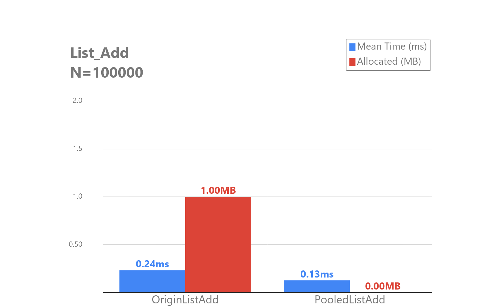
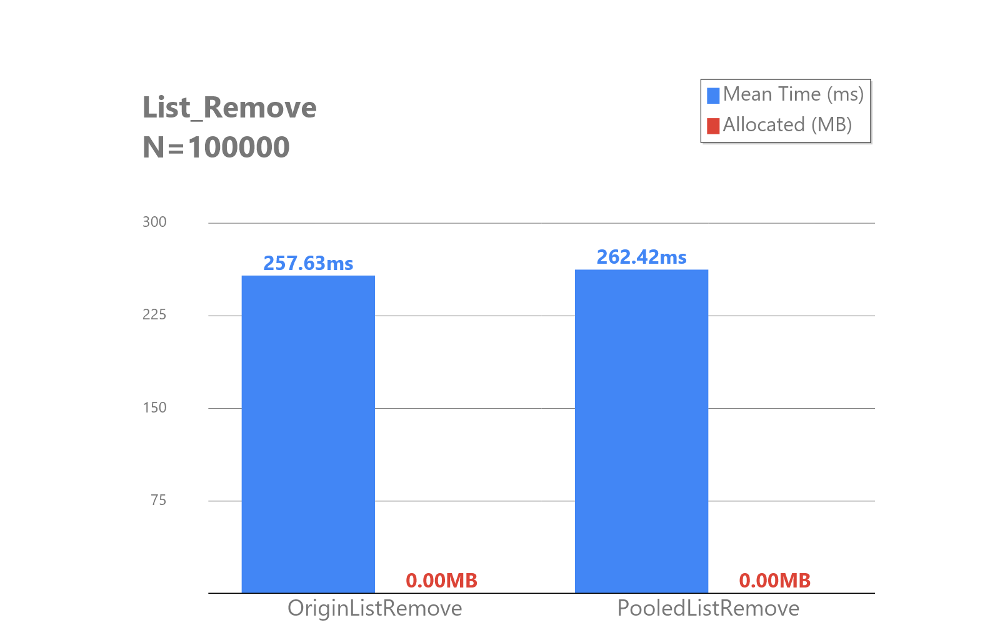
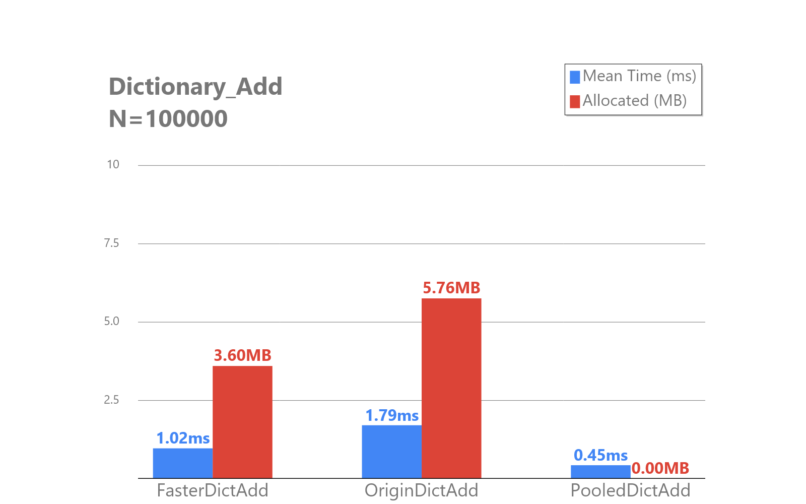
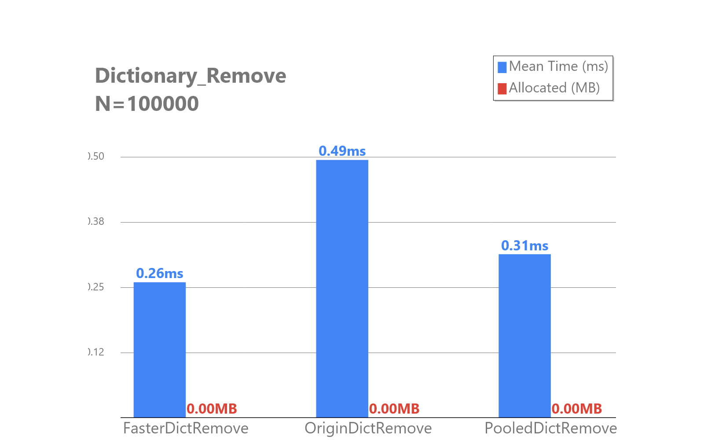
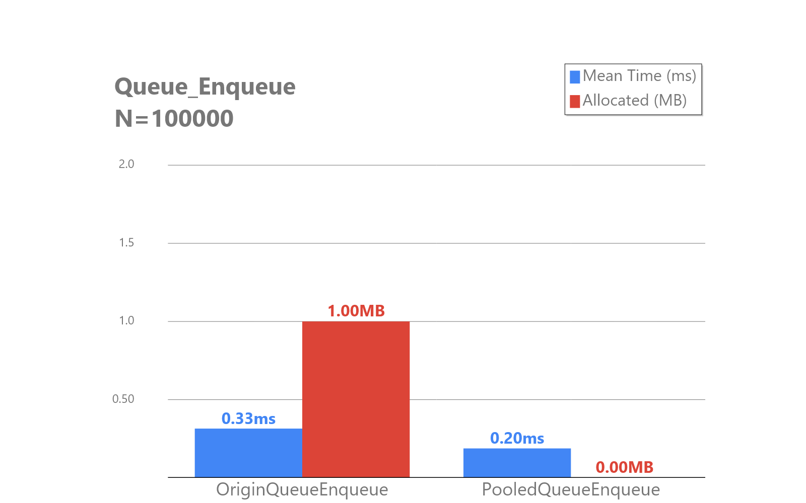
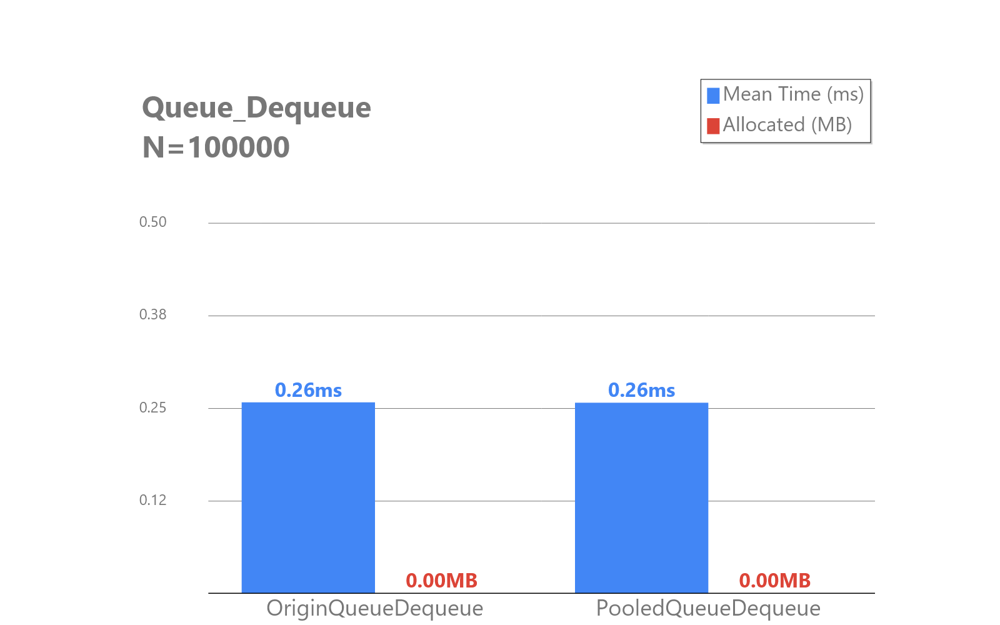
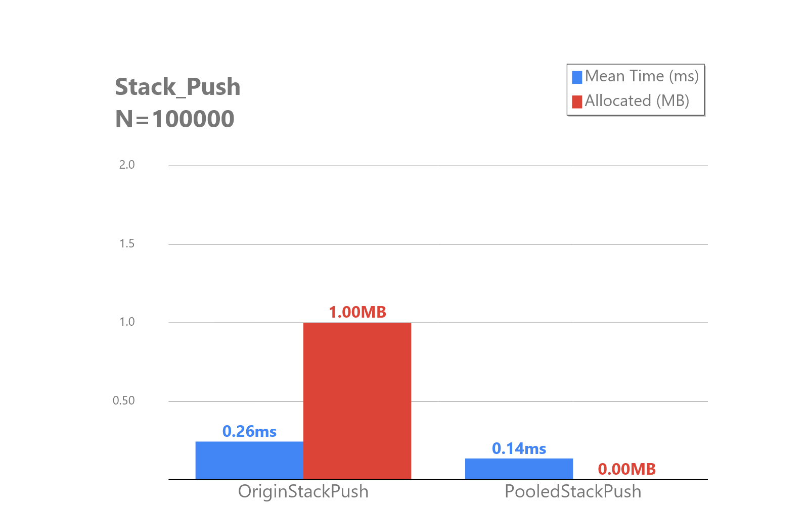
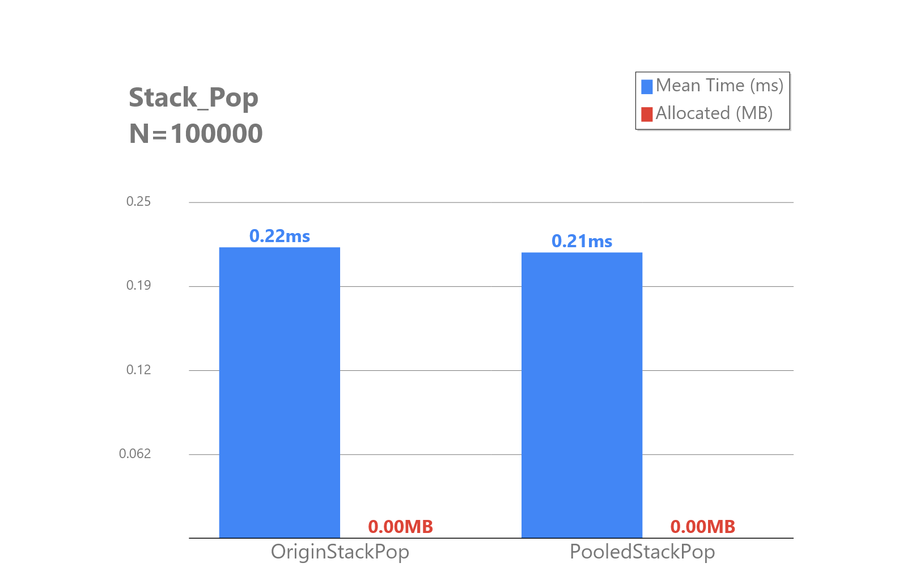
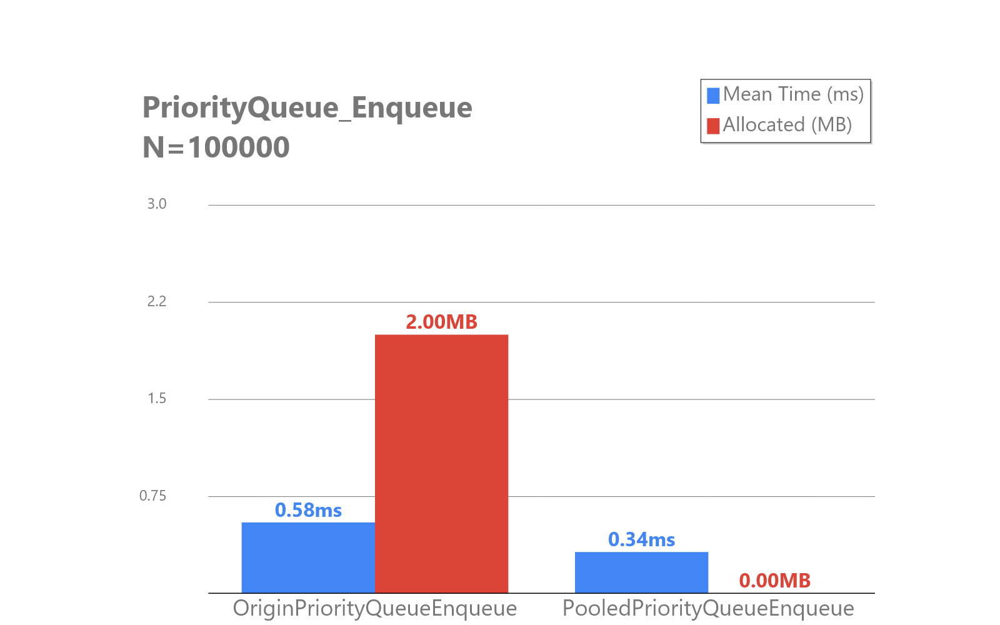
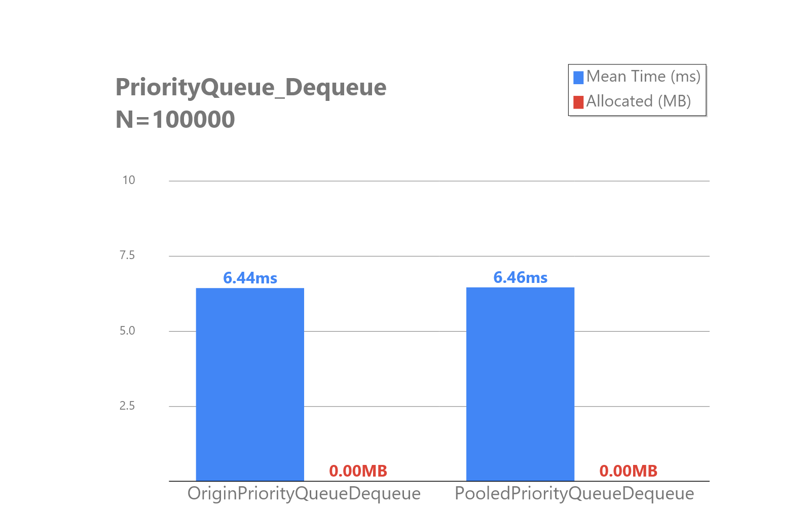

# Faster.Collections.Pooled

A high-performance collection library for .NET 10+ that provides pooled alternatives to standard collections, reducing GC pressure and improving throughput.

## Features

- **Array Pooling** - All collections leverage shared array pools to minimize allocations
- **High-Performance Hashing** - Includes optimized hash algorithms (FastHash, WyHash, xxHash3, CRC32) powered by [`Faster.Map`](https://github.com/Wsm2110/Faster.Map).  
- **Drop-in Replacements** - Compatible APIs for Dictionary, List, Queue, Stack, and PriorityQueue.  
- **Comprehensive Testing** - Includes comparison tests against BCL collections.  
- **Benchmarking** - Includes a dedicated benchmarking project for performance evaluation.  

## API Compatibility

| Collection | API Source |
|-----------|------------|
| `PooledList` | `List` |
| `PooledQueue` | `Queue` |
| `PooledStack` | `Stack` |
| `PooledPriorityQueue` | `PriorityQueue` |
| `PooledDictionary` | `FasterMap.BlitzMap` + Interfaces* of `Dictionary` |

> [!IMPORTANT]  
> \* `PooledDictionary` implements standard interfaces of `Dictionary` except `ISerializable` and `IDeserializationCallback`

## Special API

### ToPooledCollection Series
```C#
using PooledList<int> list = [1, 2, 3, 4, 5];
list.ToPooledQueue();          // Convert to PooledQueue
list.ToPooledStack();          // Convert to PooledStack
```

### Deque
```C#
using PooledDeque<int> deque = [];
deque.EnququeHead(1);
deque.EnququeTail(2);
```

### Construction based on Collection Expression
```C#
using PooledDeque<int> deque = [0];
using PooledDictionary<int, int> dict = [ 
    (1, 1), 
    (2, 2),
    (3, 3), 
];
```

## Installation

### NuGet Package

```bash
dotnet add package Faster.Collections.Pooled
```

### Build from Source

```bash
dotnet fsi build.fsx build
```

## Performance

> [!NOTE]  
> Sometimes, benchmark-dotnet or GC will allocate small amount of memory.  
> For exmaple, the benchmark below shows `System.Collections.Generic.PriorityQueue.Dequeue` allocates `0 B`, but it may allocate a few bytes in some runs.

| Method                     | N      | Mean           | Error        | StdDev       | Median         | Ratio | RatioSD | Allocated | Alloc Ratio |
|--------------------------- |------- |---------------:|-------------:|-------------:|---------------:|------:|--------:|----------:|------------:|
| **OriginPriorityQueueDequeue** | **100**    |     **2,741.8 ns** |    **168.45 ns** |    **472.36 ns** |     **2,700.0 ns** |  **1.03** |    **0.24** |     **336 B** |        **1.00** |
| PooledPriorityQueueDequeue | 100    |     2,847.4 ns |    158.32 ns |    454.26 ns |     2,800.0 ns |  1.07 |    0.24 |         - |        0.00 |
|                            |        |                |              |              |                |       |         |           |             |
| **OriginPriorityQueueDequeue** | **1000**   |    **41,531.0 ns** |    **826.78 ns** |  **1,211.88 ns** |    **41,400.0 ns** |  **1.00** |    **0.04** |         **-** |          **NA** |
| PooledPriorityQueueDequeue | 1000   |    42,242.9 ns |    783.69 ns |    694.72 ns |    42,250.0 ns |  1.02 |    0.03 |         - |          NA | 

### PooledList vs List

#### Add

> Speed up 85%, no allocations.

#### Remove

> Almost same speed, no allocations.

### PooledDictionary vs Dictionary

> Speed up 298%, no allocations.


> Speed up 58%, no allocations.

### PooledQueue vs Queue

#### Enqueue

> Speed up 65%, no allocations.

#### Dequeue

> Almost same speed, no allocations.

### PooledStack vs Stack

#### Push

> Speed up 86%, no allocations.

#### Pop

> Almost same speed, no allocations.

### PooledPriorityQueue vs PriorityQueue

#### Enqueue

> Speed up 71%, no allocations.

#### Dequeue

> Almost same speed, no allocations.

## Roadmap
- [ ] `PooledHashset` (based on `Faster.Map.BlitzSet`)
- [ ] `ISerializable` and `IDeserializationCallback` support for `PooledDictionary`
- [ ] Try using `IMemoryOwner<T>` ownership model compatible with existing types

## Acknowledgments

> [!IMPORTANT]  
> Very special thanks to the following projects:  
> - [Faster.Map](https://github.com/Wsm2110/Faster.Map) - High-performance hashing algorithms  
> - [Collections.Pooled](https://github.com/jtmueller/Collections.Pooled) - Pooled collection implementations  

## License

[MIT License](LICENSE)
